# Frequenz SDK — AI‑Native Knowledge Graph

[](https://www.python.org/downloads/)
[](https://opensource.org/licenses/MIT)
[](https://github.com/astral-sh/ruff)

> **Hiring Task Implementation**: Transform the Frequenz SDK for Python into an AI-friendly, machine-readable knowledge graph using semantic web principles and JSON-LD.

## 🎯 Overview

This project extracts key information from the **[Frequenz SDK for Python](https://github.com/frequenz-floss/frequenz-sdk-python)** repository, structures it using schema.org vocabulary, and provides semantic search capabilities to answer natural language questions.

### ✨ Key Features

- 📊 **Knowledge Extraction**: Scrapes README and generates **JSON‑LD** knowledge graphs
- 🔍 **Semantic Search**: TF-IDF + keyword-based retrieval for natural language queries  
- 🚀 **Advanced Repository Analysis**: Live code ingestion via gitingest for real-time insights
- 🎨 **Interactive Visualization**: PyVis and Graphviz network graphs
- 🌐 **Web Interface**: Streamlit apps for basic and advanced demonstrations
- ⚡ **CLI Tools**: Command-line interface for all core functionality
- 🪶 **Lightweight**: Minimal dependencies (~4MB vs 800MB+ with heavy ML libraries)
- 🧪 **Production Quality**: Comprehensive testing, linting, and cross-platform support

## 🚀 Quick Start

### Prerequisites

- **Python 3.9+** (tested on 3.9, 3.10, 3.11, 3.12)
- **Optional**: [Poetry](https://python-poetry.org/) for dependency management
- **Optional**: [Make](https://www.gnu.org/software/make/) for convenient commands

### Installation

#### Option 1: Using pip (Recommended)

```bash
# Create virtual environment
python -m venv .venv
source .venv/bin/activate  # On Windows: .venv\Scripts\activate

# Install dependencies
pip install -r requirements.txt

# Generate knowledge graph
python src/extract.py

# Test queries (hiring task requirements)
python src/query.py "What is the Frequenz SDK for?"
python src/query.py "How do I install the sdk?"
python src/query.py "Show me an example of how to use it."

# Advanced queries with live repository analysis
python src/query_advanced.py "How do I install the SDK?"
python src/query_advanced.py "What are the main features?"
python src/query_advanced.py --analyze-structure
```

#### Option 2: Using Poetry

```bash
# Install Poetry if not already installed
curl -sSL https://install.python-poetry.org | python3 -

# Install dependencies
poetry install

# Run commands via Poetry
poetry run extract
poetry run query "What is the Frequenz SDK for?"
```

#### Option 3: Using Make (Most Convenient)

```bash
# See all available commands
make help

# Full setup and test
make install
make extract
make query
make test
```

## 📦 Dependencies & Size Optimization

### Lightweight Approach

This project uses **minimal dependencies** to keep the installation size small and fast:

- **Total size**: ~4MB (vs 800MB+ with heavy ML libraries)
- **No PyTorch/Transformers**: Uses scikit-learn's TF-IDF for semantic search
- **No heavy ML libraries**: Pandas, SciPy, PyArrow are not needed for core functionality
- **Optional visualization**: NetworkX and PyVis are only loaded when needed

### Core Dependencies

```txt
# Web scraping & processing
requests>=2.31.0           # HTTP requests
beautifulsoup4>=4.12.2     # HTML parsing
markdown-it-py>=3.0.0      # Markdown processing

# Semantic search (lightweight)
scikit-learn>=1.3.0        # TF-IDF vectorization only

# Visualization (optional)
networkx>=3.0              # Graph structures
pyvis>=0.3.2               # Interactive graphs
graphviz>=0.20.1           # Static graph rendering

# Web interface
streamlit>=1.33.0          # Demo applications

# Repository analysis
gitingest>=0.1.0           # Live repo ingestion
python-dotenv>=1.0.1       # Environment variables
```

### Why Not Heavy ML Libraries?

**PyTorch/Transformers** (339MB+): Not used in the codebase
- ❌ No neural networks or deep learning
- ❌ No transformer models or embeddings
- ✅ TF-IDF provides sufficient semantic search for documentation

**Pandas/SciPy/PyArrow** (239MB+): Overkill for simple data processing
- ❌ No complex data analysis or scientific computing
- ✅ Built-in Python data structures are sufficient

### Cleaning Up Large Dependencies

If you accidentally installed heavy dependencies:

```bash
# Remove unused heavy libraries
pip uninstall torch transformers sentence-transformers pyarrow scipy pandas sympy

# Or recreate clean environment
rm -rf .venv
python -m venv .venv
source .venv/bin/activate
pip install -r requirements.txt
```

## 📋 Usage

### Core Commands (Hiring Task Requirements)

The project provides three main CLI tools as required by the hiring task:

#### 1. Knowledge Extraction

```bash
# Extract from default Frequenz SDK repository
python src/extract.py

# Extract from specific GitHub URL
python src/extract.py --repo-url https://raw.githubusercontent.com/frequenz-floss/frequenz-sdk-python/v1.x.x/README.md

# Extract from local README file
python src/extract.py --local-readme path/to/README.md

# With Poetry
poetry run extract --repo-url https://github.com/frequenz-floss/frequenz-sdk-python/blob/main/README.md
```

#### 2. Natural Language Queries

```bash
# Required queries from hiring task
python src/query.py "What is the Frequenz SDK for?"
python src/query.py "How do I install the sdk?"
python src/query.py "Show me an example of how to use it."

# Additional supported queries
python src/query.py "What license is it under?"
python src/query.py "Which Python versions does it require?"
python src/query.py "What features does it have?"

# With Poetry
poetry run query "How do I install the sdk?"
```

#### 3. Knowledge Graph Visualization

```bash
# Generate DOT file for Graphviz
python src/visualize.py --format dot --out knowledge_graph.dot

# Generate SVG (requires Graphviz installed)
python src/visualize.py --format svg --out knowledge_graph.svg

# With Poetry
poetry run visualize --format svg --out knowledge_graph.svg
```

### Web Applications

#### Basic Streamlit App (Hiring Task Demo)

```bash
# Start basic app
streamlit run src/apps/app.py
# Or with Make
make app

# Features:
# - README extraction with BeautifulSoup
# - Basic semantic search (TF-IDF + keywords)
# - Interactive PyVis and static Graphviz visualizations
# - Preset question dropdown for required queries
```

#### Advanced Streamlit App

```bash
# Start advanced app
streamlit run src/apps/app_advanced.py --server.port 8503
# Or with script
python scripts/run_advanced_app.py

# Optional: provide Perplexity API key via .env or sidebar
cp .env.example .env  # then edit .env to add PERPLEXITY_API_KEY
```

## 🛠️ Development

### Make Commands

```bash
make help              # Show all available commands
make install           # Install dependencies (Poetry or pip)
make test              # Run comprehensive test suite
make test-fast         # Run tests without linting (faster)
make lint              # Run code linting (Ruff)
make format            # Format code (Ruff)
make clean             # Clean temporary files
make extract           # Extract knowledge graph
make query             # Test query interface
make compliance        # Run hiring task compliance tests
make app               # Start basic Streamlit app
make app-advanced      # Start advanced app
make smoke             # Run compliance with Streamlit smoke tests
make theme             # Show or create Streamlit theme config
```

### Testing

```bash
# Run all tests and quality checks (combined compliance + optional quality gates)
make test
python scripts/run_tests.py

# Run only the consolidated compliance test
python tests/test_compliance.py -v

# Optional: include Streamlit smoke tests (launch apps headlessly)
RUN_STREAMLIT_SMOKE=1 python tests/test_compliance.py -v
```

### Environment (.env)

```bash
# Copy example and fill in your Perplexity key (optional, for advanced app)
cp .env.example .env

# Edit .env to set:
# PERPLEXITY_API_KEY=your_perplexity_api_key_here
# PERPLEXITY_DEFAULT_MODEL=Sonar Pro
```

Notes:
- The advanced app reads `.env` automatically (via python‑dotenv) and also accepts the key from the sidebar.
- The basic app does not require any API keys.

### Code Quality

```bash
# Linting with Ruff
make lint
ruff check .

# Code formatting
make format
ruff format .

# Check formatting without applying
ruff format --check .
```

## 📁 Project Structure

This project follows professional Python packaging standards with clean separation of concerns:

```
frequenz_ai_native_task/                    # 🏠 Project Root
│
├── 📖 README.md                            # ⭐ Main documentation (this file)
├── ⚖️  LICENSE                             # MIT License
├── 🚫 .gitignore                          # Git ignore rules
│
├── ⚙️  pyproject.toml                     # Python project configuration
├── 📦 requirements.txt                     # pip dependencies
├── 🔨 Makefile                            # Cross-platform build commands
│
├── 📂 src/                                # 🎯 CORE SOURCE CODE
│   ├── 🔧 extract.py                      # Knowledge extraction (hiring task)
│   ├── 🔧 query.py                        # Natural language queries (hiring task)
│   ├── 🔧 visualize.py                    # Graph visualization (hiring task)
│   └── 📂 apps/                           # 🌐 WEB APPLICATIONS
│       ├── 🌐 app.py                      # Basic Streamlit demo
│       └── 🌐 app_advanced.py            # Advanced demo (optional)
│
├── 📂 data/                               # 📊 GENERATED DATA & OUTPUTS
│   ├── 📊 project_knowledge.jsonld        # Primary knowledge graph
│   ├── 📈 knowledge_graph.dot             # DOT visualization file
│   ├── 📈 knowledge_graph.svg             # SVG visualization file
│   └── 📝 .gitkeep                        # Keep directory in git
│
├── 📂 temp/                               # 🧪 RUNTIME (ignored by git)
│   └── 📁 .run/                           # Logs + PIDs for local runs
│
├── 📂 .streamlit/                         # 🎨 STREAMLIT THEME
│   └── ⚙️  config.toml                    # Project theme (committed)
│
├── 📂 tests/                              # 🧪 TESTING SUITE
│   └── 🧪 test_compliance.py              # Hiring task compliance tests
│
├── 📂 scripts/                            # 🔧 UTILITY SCRIPTS
│   ├── 🔧 run_tests.py                    # Production test runner
│   ├── 🔧 run_basic_app.py                # Start basic app
│   └── 🔧 run_advanced_app.py             # Start advanced app
│
├── 📂 docs/                               # 📚 DOCUMENTATION
│   ├── 📚 hiring_task/                    # Hiring task requirements
│   │   ├── HiringTask.md                  # Task description
│   │   └── Hiring_Task_PDF.pdf            # Original PDF
│   └── 📚 examples/                       # Usage examples
│
├── 📂 assets/                             # 🖼️  STATIC ASSETS
│   ├── 🖼️  logos/                         # Project logos
│   │   └── frequenz_com_logo.jpeg         # Company logo
│   └── 🎨 styles/                         # CSS, themes
│
└── 📂 temp/                               # 🧪 RUNTIME (ignored by git)
    └── 📁 .run/                           # Logs + PIDs for local runs
```

### **📋 Directory Purposes**

- **`src/`** - Core hiring task scripts and functionality
- **`src/apps/`** - Web applications (Streamlit demos)  
- **`data/`** - Generated knowledge graphs and visualizations
- **`tests/`** - Hiring task compliance tests
- **`scripts/`** - Utility scripts and automation
- **`docs/`** - Project documentation and requirements
- **`assets/`** - Static files (logos, images, styles)
- **`temp/`** - Runtime (ephemeral logs/PIDs only)

## 🎯 Hiring Task Compliance

This implementation fully satisfies all hiring task requirements:

### ✅ Part 1: Knowledge Modeling & Extraction

- **Schema Design**: Uses schema.org vocabulary (`SoftwareApplication`, `HowTo`, `Question`, `Answer`)
- **Extraction Script**: `src/extract.py` uses BeautifulSoup to parse GitHub README
- **Structured Output**: Generates `project_knowledge.jsonld` in valid JSON-LD format
- **Information Coverage**: Captures name, description, installation, examples, license, dependencies

### ✅ Part 2: Knowledge Retrieval Application

- **Query Script**: `src/query.py` accepts natural language questions as CLI arguments
- **Semantic Search**: Implements TF-IDF cosine similarity with keyword fallback
- **Required Queries**: All three example queries work correctly
- **Simple NLP Logic**: Uses basic keyword matching and TF-IDF (no LLM/vector DB required)

### ✅ Part 3: Explanation & Rationale

- **README Documentation**: Comprehensive explanation of design choices and processes
- **Schema Justification**: Clear rationale for schema.org selection and structure
- **Process Description**: Detailed extraction and retrieval methodology
- **Future Improvements**: Discusses LLM integration, vector databases, and automation

### ✅ Additional Deliverables

- **Git Repository**: Clean, well-organized codebase
- **Requirements File**: Both `requirements.txt` and `pyproject.toml`
- **Code Quality**: Clean, well-commented, production-ready code
- **Testing**: Comprehensive test suite with compliance validation

## 🔧 Technical Implementation

### Schema Design Rationale

**Primary Schema**: `schema.org/SoftwareApplication`
- **Why**: Industry standard for software projects, well-supported by search engines
- **Extensions**: Custom `frequenz.com/ontology#` namespace for domain-specific properties
- **Structure**: Hierarchical with embedded `HowTo` for installation, `SoftwareSourceCode` for examples

**Key Design Decisions**:
1. **Semantic Web Standards**: Ensures interoperability and future compatibility
2. **Structured Data**: Machine-readable format supports AI/ML applications
3. **Linked Data Principles**: Uses URIs and standard vocabularies
4. **Extensibility**: Custom ontology namespace allows domain-specific extensions

### Retrieval Strategy

**Hybrid Approach**: TF-IDF + Keyword Bucketing
1. **TF-IDF Semantic Matching**: Handles varied phrasings and synonyms
2. **Keyword Bucketing**: Reliable fallback for core question types
3. **Confidence Thresholding**: Automatically chooses best method based on confidence
4. **Domain Tuning**: Optimized for technical documentation queries

### Cross-Platform Compatibility

**Operating Systems**: Windows, macOS, Linux
- ✅ **Pure Python**: No OS-specific dependencies
- ✅ **Path Handling**: Uses `pathlib` for cross-platform paths
- ✅ **Virtual Environment**: Standard Python venv works everywhere
- ✅ **Optional Dependencies**: Graceful handling of missing packages

**Python Versions**: 3.9, 3.10, 3.11, 3.12
- ✅ **Tested Compatibility**: CI/CD tests across Python versions
- ✅ **Modern Features**: Uses typing and dataclasses where appropriate
- ✅ **Backward Compatibility**: No bleeding-edge syntax requirements

## 🚀 Future Improvements

### Next Steps for Production

1. **Enhanced AI Integration** (Optional Heavy Dependencies)
   - Embedding models (sentence-transformers, OpenAI) - adds ~400MB
   - Vector databases (Pinecone, Weaviate, Chroma)
   - Hybrid BM25 + semantic search
   - Note: Current TF-IDF approach is sufficient for most use cases

2. **Content Processing**
   - Chunking strategies for large documents
   - Multi-modal content (images, code, diagrams)
   - Real-time repository synchronization

3. **RAG Pipeline Integration**
   - LangChain/LlamaIndex integration
   - Conversational interfaces
   - Context-aware question answering

4. **Automation & Deployment**
   - GitHub Actions for auto-updates
   - Docker containerization
   - REST API endpoints
   - Web publication for SEO

5. **AI Visibility & Discovery**
   - Schema.org markup on documentation sites
   - Rich snippets for search engines
   - API integration with AI tools (Perplexity, ChatGPT)

## 📜 License

This project is licensed under the [MIT License](https://opensource.org/licenses/MIT).

## 🙏 Acknowledgments

- **Frequenz**: For providing the excellent SDK and hiring challenge
- **Schema.org**: For semantic web vocabulary standards
- **Python Community**: For the amazing ecosystem of tools and libraries

---

> **Note**: This is a hiring task demonstration. The actual Frequenz SDK documentation and resources are available at [frequenz-floss.github.io/frequenz-sdk-python](https://frequenz-floss.github.io/frequenz-sdk-python/).
### Architecture Diagram

Below is a clickable Mermaid diagram that links to relevant sections of the Frequenz SDK repository.

```mermaid
flowchart TB
    subgraph Client["Client Applications"]
        App1[Application 1]
        App2[Application 2]
    end

    subgraph Core["SDK Core"]
        Actor["Actor System"]:::core
        Microgrid["Microgrid Management"]:::core
        TimeSeries["Time Series Processing"]:::core
        Config["Config Management"]:::core
    end

    subgraph Components["Component Management"]
        Battery["Battery Pool"]:::component
        EVCharger["EV Charger Pool"]:::component
        PV["PV Pool"]:::component
        LogicalMeter["Logical Meter"]:::component
    end

    subgraph Power["Power Management"]
        PowerDist["Power Distribution"]:::power
        PowerManage["Power Managing"]:::power
        PowerWrap["Power Wrapper"]:::power
        Formula["Formula Engine"]:::power
    end

    subgraph Data["Data Processing"]
        DataSource["Data Sourcing"]:::data
        Resampling["Resampling"]:::data
        RingBuffer["Ring Buffer"]:::data
        MovingWindow["Moving Window"]:::data
    end

    Client --> Core
    Core --> Components
    Core --> Power
    Core --> Data

    Actor <--> Microgrid
    Actor <--> TimeSeries
    Actor <--> Config

    Battery <--> PowerDist
    EVCharger <--> PowerDist
    PV <--> PowerDist
    LogicalMeter <--> PowerDist

    PowerDist <--> PowerManage
    PowerManage <--> PowerWrap
    Formula <--> TimeSeries

    DataSource --> RingBuffer
    RingBuffer --> MovingWindow
    MovingWindow --> Resampling

    click Actor "https://github.com/frequenz-floss/frequenz-sdk-python/tree/v1.x.x/src/frequenz/sdk/actor/"
    click Microgrid "https://github.com/frequenz-floss/frequenz-sdk-python/tree/v1.x.x/src/frequenz/sdk/microgrid/"
    click TimeSeries "https://github.com/frequenz-floss/frequenz-sdk-python/tree/v1.x.x/src/frequenz/sdk/timeseries/"
    click Config "https://github.com/frequenz-floss/frequenz-sdk-python/tree/v1.x.x/src/frequenz/sdk/config/"
    click PowerDist "https://github.com/frequenz-floss/frequenz-sdk-python/tree/v1.x.x/src/frequenz/sdk/microgrid/_power_distributing/"
    click DataSource "https://github.com/frequenz-floss/frequenz-sdk-python/tree/v1.x.x/src/frequenz/sdk/microgrid/_data_sourcing/"
    click Formula "https://github.com/frequenz-floss/frequenz-sdk-python/tree/v1.x.x/src/frequenz/sdk/timeseries/formula_engine/"
    click Battery "https://github.com/frequenz-floss/frequenz-sdk-python/tree/v1.x.x/src/frequenz/sdk/timeseries/battery_pool/"
    click EVCharger "https://github.com/frequenz-floss/frequenz-sdk-python/tree/v1.x.x/src/frequenz/sdk/timeseries/ev_charger_pool/"
    click PV "https://github.com/frequenz-floss/frequenz-sdk-python/tree/v1.x.x/src/frequenz/sdk/timeseries/pv_pool/"
    click PowerManage "https://github.com/frequenz-floss/frequenz-sdk-python/tree/v1.x.x/src/frequenz/sdk/microgrid/_power_managing/"
    click LogicalMeter "https://github.com/frequenz-floss/frequenz-sdk-python/tree/v1.x.x/src/frequenz/sdk/timeseries/logical_meter/"

    classDef core fill:#3498db,stroke:#2980b9,color:white
    classDef component fill:#2ecc71,stroke:#27ae60,color:white
    classDef power fill:#e67e22,stroke:#d35400,color:white
    classDef data fill:#9b59b6,stroke:#8e44ad,color:white
```



Mermaid source is also available at `assets/diagrams/sdk_architecture.mmd`. To render a static SVG locally (for docs outside GitHub), install Mermaid CLI and run:

```bash
npm install -g @mermaid-js/mermaid-cli
make diagrams
```

Static SVG (downloadable):



Note: Interactivity of links inside the SVG depends on the viewer. The Mermaid block above remains fully clickable on GitHub.
